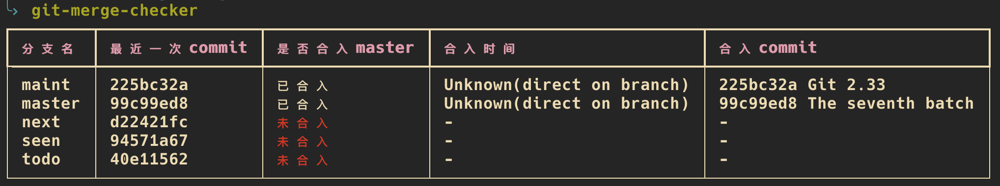

# git-merge-checker

## 说明

git-merge-checker 是一个用于检查 git 分支多合漏合的命令行工具，其中获取合入时间的特性适用于三路合并(Merge)的 git 工作方式。

以 [github.com/git/git](https://github.com/git/git) 为例：



## 安装

提供了 Windows 和 Mac OS 编译后的二进制文件，请前往 github release 下载.

### Windows

下载后设置系统环境变量即可

### Mac OS

1. 下载放至 /usr/local/bin/git-merge-checker, 确保 `/usr/local/bin` 在 `$PATH` 环境变量中
2. 添加可执行权限 chmod u+x /usr/local/bin/git-merge-checker

## 用法

- 指定目标分支名。展示仓库所有远程分支到目标分支的合入情况，默认取当前分支：

```shell script
git-merge-checker <branch_name>
```

- 指定源分支名。只展示指定分支到目标分支的合入情况，-b <source_branch_name>，支持通配符匹配，以筛选 'feature/' 或 'temp/' 开头的分支为例：

```shell script
git-merge-checker <branch_name> -b 'feature/*' -b 'temp/*'
```

## 参考

* [git-when-merged](https://github.com/mhagger/git-when-merged)
* ancestry-path  https://stackoverflow.com/questions/8475448/find-merge-commit-which-include-a-specific-commit
* 如何批量获取分支信息  https://stackoverflow.com/questions/5188320/how-can-i-get-a-list-of-git-branches-ordered-by-most-recent-commit